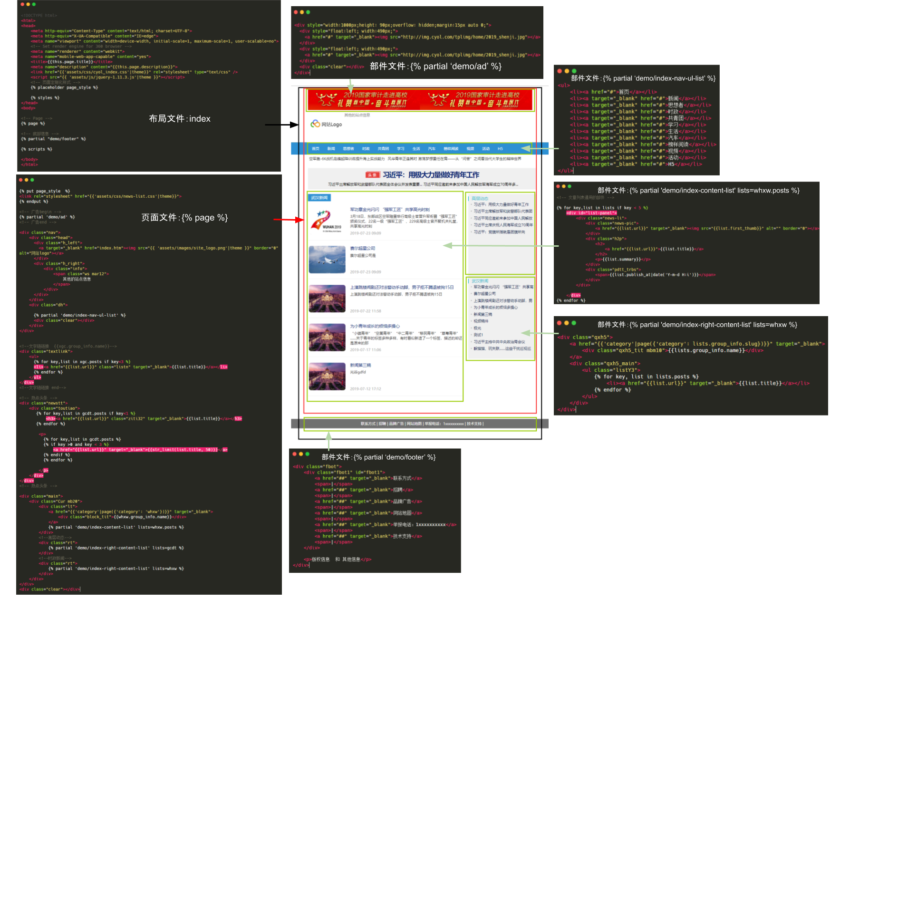

# 实例解析

下面通过一个实例来对以上概念进行可视化的说明。

假如要创建一个网站的首页，首页页面有以下的内容组成

1. 顶部广告
2. 网站Logo和超链接信息
3. 导航栏
4. 文章列表和头条新闻
5. 缩略图、标题和缩略信息的文章列表
6. 侧边的内容列表信息

要将下面的信息展示在一个页面我们可以通过下面的方式

> 图片源文件见 [https://docs.google.com/drawings/d/1CQL0yb\_5S5tg6BRv0vwU7SyAmg9\_-5iW3hQUGLzBf74/edit](https://docs.google.com/drawings/d/1CQL0yb_5S5tg6BRv0vwU7SyAmg9_-5iW3hQUGLzBf74/edit)

我们新建了一个首页的布局文件，在布局中引入了页面底部的部件`demo/footer`，在页面中引入了广告部件`demo/ad`、导航栏部件`demo/index-nav-ul-list`、带图文的内容列表部件`demo/index-content-list`，同时传递了数据`whxw.posts`，页面右侧的内容列表部件`demo/index-right-content-list`，分别传递了数据`whxw和gcdt`，达到了最后显示的效果。

